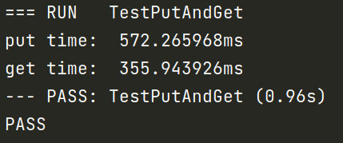
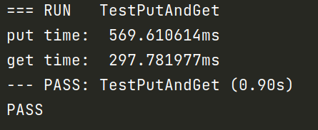

   [](https://pkg.go.dev/github.com/ByteStorage/flydb)            [](https://goreportcard.com/report/github.com/qishenonly/flydb) 

English | [中文](https://github.com/ByteStorage/flydb/blob/master/README_CN.md)

**FlyDB** aims to serve as an alternative to in-memory key-value storage (such as **Redis**) in some cases, aiming to strike a balance between performance and storage cost. It does this by optimizing resource allocation and using cost-effective storage media. By intelligently managing data, **FlyDB** ensures efficient operations while minimizing storage costs. It provides a reliable solution for scenarios that require a balance between performance and storage costs.

## 📚 What is FlyDB ?

**FlyDB** is a high-performance key-value (KV) storage engine based on the efficient bitcask model. It offers fast and reliable data retrieval and storage capabilities. By leveraging the simplicity and effectiveness of the bitcask model, **FlyDB** ensures efficient read and write operations, resulting in improved overall performance. It provides a streamlined approach to storing and accessing key-value pairs, making it an excellent choice for scenarios that require fast and responsive data access. **FlyDB's** focus on speed and simplicity makes it a valuable alternative for applications that prioritize performance while balancing storage costs. 

## 🏁  Fast Start: FlyDB 

You can install FlyDB using the Go command line tool:

```GO
go get github.com/ByteStorage/FlyDB@v1.0.6
```

Or clone this project from github:

```bash
git clone https://github.com/ByteStorage/FlyDB.git
```

## 🖥 How to use FlyDB ?

Here is a simple example of how to use the Linux version:

> See flydb/examples for details.

```go
package main

import (
	"fmt"
	"github.com/ByteStorage/FlyDB/flydb"
	"github.com/ByteStorage/FlyDB/config"
)

func main() {
    	options := config.DefaultOptions
	options.DirPath = "/tmp/flydb"
	db, _ := flydb.NewFlyDB(options)

    	err := db.Put([]byte("name"), []byte("flydb-example"))
    	if err != nil {
        	fmt.Println("Put Error => ", err)
    	}


	val, err := db.Get([]byte("name"))
	if err != nil {
		fmt.Println("Get Error => ", err)
	}
    	fmt.Println("name value => ", string(val))
    
    
    	err := db.Delete([]byte("name"))
    	if err != nil {
        	fmt.Println("Delete Error => ", err)
    	}
}
```
>You can also run this command.

```shell
./build.sh
```

## 🚀 Performance test

We did a simple performance test of the V1.0.4 version of FlyDB. This test mainly focused on reading and writing large-scale data, and we selected 500,000 random data for testing.

Through testing, we found that in V1.0.4, with 500,000 data:

#### BTree Index

PUT performance: 572.265968ms

GET performance: 355.943926ms



#### ARTree Index

PUT performance: 569.610614ms

GET performance: 297.781977ms




If you have a better way to optimize read and write performance, please submit your 'pr'.

## 📢 Benchmark test

We compared the results of a benchmark test using FlyDB V1.0.4 with other kv databases written in golang on the market and found that the read/write performance test results exceeded most open source kv databases.

> See in detail: https://github.com/ByteStorage/contrast-benchmark

```
goos: linux
goarch: amd64
pkg: contrast-benchmark
cpu: 11th Gen Intel(R) Core(TM) i7-11800H @ 2.30GHz

Benchmark_PutValue_FlyDB
Benchmark_PutValue_FlyDB-16        	   95023	     13763 ns/op	    2904 B/op	      16 allocs/op
Benchmark_GetValue_FlyDB
Benchmark_GetValue_FlyDB-16    	 	 2710143	     463.5 ns/op	     259 B/op	       5 allocs/op
Benchmark_PutValue_Badger
Benchmark_PutValue_Badger-16       	   59331	     22711 ns/op	    6006 B/op	      48 allocs/op
Benchmark_GetValue_Badger
Benchmark_GetValue_Badger-16       	  158686	      7686 ns/op	   10844 B/op	      42 allocs/op
Benchmark_PutValue_BoltDB
Benchmark_PutValue_BoltDB-16       	   32637	     56519 ns/op	   21009 B/op	     123 allocs/op
Benchmark_GetValue_BoltDB
Benchmark_GetValue_BoltDB-16       	  655971	     24327 ns/op	     723 B/op	      26 allocs/op 
Benchmark_PutValue_GoLevelDB
Benchmark_PutValue_GoLevelDB-16    	   71931	     14709 ns/op	    2226 B/op	      12 allocs/op
Benchmark_GetValue_GoLevelDB
Benchmark_GetValue_GoLevelDB-16    	  500736	      2520 ns/op	    1278 B/op	      15 allocs/op
Benchmark_PutValue_NutsDB
Benchmark_PutValue_NutsDB-16       	   78801	     13582 ns/op	    3242 B/op	      22 allocs/op
Benchmark_GetValue_NutsDB
Benchmark_GetValue_NutsDB-16       	  373124	      5702 ns/op	    1392 B/op	      14 allocs/op
Benchmark_PutValue_RoseDB
Benchmark_PutValue_RoseDB-16       	   69776	     19166 ns/op	    6242 B/op	      59 allocs/op
Benchmark_GetValue_RoseDB
Benchmark_GetValue_RoseDB-16       	 4155183	     298.0 ns/op	     167 B/op	       4 allocs/op
Benchmark_PutValue_Pebble
Benchmark_PutValue_Pebble-16       	   91304	     21877 ns/op	    2720 B/op	       8 allocs/op
Benchmark_GetValue_Pebble
Benchmark_GetValue_Pebble-16       	   66135	     15837 ns/op	   17193 B/op	      22 allocs/op
PASS
```

## 🔮 How to contact us ?

If you have any questions and want to contact us, you can contact our developer team, we will reply to your email:

Team Email: bytestoragecommunity@gmail.com

Or add my wechat, invite you to enter the project community, and code masters together to exchange learning.

> Add wechat please comment GIthub


## ✅ TODO List

- [ ] Extended data structure support: including but not limited to string, list, hash, set, etc.
- [ ] Compatible with Redis protocols and commands.
- [ ] Support http services.
- [x] Support tcp services.
- [x] Log aggregation
- [ ] Data backup
- [ ] Distributed cluster model.

## 📜 Version update list

V1.0.4: The short-term support version v1.0.4 uses mmap to optimize the index part, significantly improving read and write performance compared to the v1.0.3 version. The 50w data write speed has accelerated from 1.35 seconds to 0.56 seconds, and the read speed has accelerated from 1.06 seconds to 0.355 seconds.

V1.0.5: Short-term support version v1.0.5 supports data structures of type String and List. Some codes are optimized.

V1.0.6: Short-term support version v1.0.6 supports data structures of Hash type. Some codes are optimized.

V1.0.7: Short-term support version v1.0.7 supports data structures of BitMap type. Some codes are optimized.

## 👀 Contributor

<a href="https://github.com/ByteStorage/FlyDB/graphs/contributors">

 
</a>

## 📝 How to contribute ?

If you have any ideas or suggestions for FlyDB, please feel free to submit 'issues' or' pr 'on GitHub. We welcome your contributions!

> Please refer to the complete specification procedure：[CONTRIBUTEING](https://github.com/ByteStorage/flydb/blob/master/CONTRIBUTING.md)

## 📋 Licence

FlyDB is released under the Apache license. For details, see LICENSE file.

## Thanks To JetBrains

> Thanks to `JetBrains` for the free open source license.  


