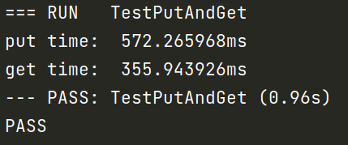
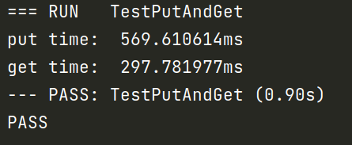

   [](https://pkg.go.dev/github.com/ByteStorage/flydb)            [](https://goreportcard.com/report/github.com/qishenonly/flydb)


**FlyDB**旨在在某些情况下作为内存键值存储(如**Redis**)的替代方案，旨在在性能和存储成本之间取得平衡。它通过优化资源分配和使用经济有效的存储介质来实现这一点。通过智能管理数据，**FlyDB**确保高效操作，同时最大限度地降低存储成本。它为需要在性能和存储成本之间取得平衡的场景提供了可靠的解决方案。

## 👋 什么是 FlyDB ?

**FlyDB**是基于高效bitcask模型的高性能键值(KV)存储引擎。它提供了快速可靠的数据检索和存储功能。通过利用bitcask模型的简单性和有效性，**FlyDB**确保了高效的读写操作，从而提高了整体性能。它提供了一种简化的方法来存储和访问键值对，使其成为需要快速响应数据访问的场景的绝佳选择。**FlyDB**对速度和简单性的关注使其成为在平衡存储成本的同时优先考虑性能的应用程序的有价值的替代方案。

## 🏁  快速入门 : FlyDB

您可以使用Go命令行工具安装FlyDB:

```GO
go get github.com/ByteStorage/FlyDB@v1.0.6
```

或者从github克隆这个项目:

```bash
git clone https://github.com/ByteStorage/FlyDB
```

## 🚀 如何使用 FlyDB ?

下面是一个如何使用Linux版本的简单示例:

> 详情请参阅 flydb/examples。

```go
package main

import (
	"fmt"
	"github.com/ByteStorage/FlyDB/flydb"
	"github.com/ByteStorage/FlyDB/config"
)

func main() {
    	options := config.DefaultOptions
	options.DirPath = "/tmp/flydb"
	db, _ := flydb.NewFlyDB(options)

    	err := db.Put([]byte("name"), []byte("flydb-example"))
    	if err != nil {
        	fmt.Println("Put Error => ", err)
    	}


	val, err := db.Get([]byte("name"))
	if err != nil {
		fmt.Println("Get Error => ", err)
	}
    	fmt.Println("name value => ", string(val))
    
    
    	err := db.Delete([]byte("name"))
    	if err != nil {
        	fmt.Println("Delete Error => ", err)
    	}
}


```
>你也可以执行以下命令。
```shell
./build.sh
```
## 🚀 性能测试

我们对V1.0.4版本的FlyDB做了一个简单的性能测试。本次测试主要针对大规模数据的读写，我们随机选取了50万条数据进行测试。

通过测试，我们发现在V1.0.4中，在50万条数据的情况下:

#### BTree 索引

PUT 性能: 572.265968ms

GET 性能: 355.943926ms



#### ARTree 索引

PUT 性能: 569.610614ms

GET 性能: 297.781977ms




如果您有更好的方法来优化读写性能，请提交您的“pr”。

## 📢 基准测试

我们使用FlyDB V1.0.4的基准测试结果与市面上用golang编写的其他kv数据库进行了比较，发现读/写性能测试结果均超过了大多数开源kv数据库。

>详情见:https://github.com/ByteStorage/contrast-benchmark

```
goos: linux
goarch: amd64
pkg: contrast-benchmark
cpu: 11th Gen Intel(R) Core(TM) i7-11800H @ 2.30GHz

Benchmark_PutValue_FlyDB
Benchmark_PutValue_FlyDB-16        	   95023	     13763 ns/op	    2904 B/op	      16 allocs/op
Benchmark_GetValue_FlyDB
Benchmark_GetValue_FlyDB-16    	 	 2710143	     463.5 ns/op	     259 B/op	       5 allocs/op
Benchmark_PutValue_Badger
Benchmark_PutValue_Badger-16       	   59331	     22711 ns/op	    6006 B/op	      48 allocs/op
Benchmark_GetValue_Badger
Benchmark_GetValue_Badger-16       	  158686	      7686 ns/op	   10844 B/op	      42 allocs/op
Benchmark_PutValue_BoltDB
Benchmark_PutValue_BoltDB-16       	   32637	     56519 ns/op	   21009 B/op	     123 allocs/op
Benchmark_GetValue_BoltDB
Benchmark_GetValue_BoltDB-16       	  655971	     24327 ns/op	     723 B/op	      26 allocs/op 
Benchmark_PutValue_GoLevelDB
Benchmark_PutValue_GoLevelDB-16    	   71931	     14709 ns/op	    2226 B/op	      12 allocs/op
Benchmark_GetValue_GoLevelDB
Benchmark_GetValue_GoLevelDB-16    	  500736	      2520 ns/op	    1278 B/op	      15 allocs/op
Benchmark_PutValue_NutsDB
Benchmark_PutValue_NutsDB-16       	   78801	     13582 ns/op	    3242 B/op	      22 allocs/op
Benchmark_GetValue_NutsDB
Benchmark_GetValue_NutsDB-16       	  373124	      5702 ns/op	    1392 B/op	      14 allocs/op
Benchmark_PutValue_RoseDB
Benchmark_PutValue_RoseDB-16       	   69776	     19166 ns/op	    6242 B/op	      59 allocs/op
Benchmark_GetValue_RoseDB
Benchmark_GetValue_RoseDB-16       	 4155183	     298.0 ns/op	     167 B/op	       4 allocs/op
Benchmark_PutValue_Pebble
Benchmark_PutValue_Pebble-16       	   91304	     21877 ns/op	    2720 B/op	       8 allocs/op
Benchmark_GetValue_Pebble
Benchmark_GetValue_Pebble-16       	   66135	     15837 ns/op	   17193 B/op	      22 allocs/op
PASS
```

## 🔮 如何联系我们?

如果您有任何疑问并想与我们联系，您可以联系我们的开发团队，我们会回复您的邮件:

团队邮箱:bytestoragecommunity@gmail.com

或者加我微信，邀请大家进入项目社区，和大牛一起交流学习。

> 添加微信请备注Github


## ✅ TODO List

- [ ] 扩展数据结构支持:包括但不限于字符串、列表、散列、集合等。
- [ ] 兼容Redis协议和命令。
- [ ] 支持http服务。
- [x] 支持tcp服务。
- [x] 集成日志。
- [ ] 数据备份
- [ ] 分布式集群模型。

## 📜 版本更新信息

V1.0.4: 短期支持版本v1.0.4使用mmap来优化索引部分，与v1.0.3版本相比，显著提高了读写性能。50w数据写入速度从1.35秒加快到0.56秒，读取速度从1.06秒加快到0.355秒。

V1.0.5: 短期支持版本v1.0.5支持String、List类型的数据结构。并对部分代码进行了优化。 

V1.0.6: 短期支持版本v1.0.6支持Hash类型的数据结构。并对部分代码进行了优化。

V1.0.7: 短期支持版本v1.0.7支持BitMap类型的数据结构。并对部分代码进行了优化。

## 👀 贡献者列表

<a href="https://github.com/ByteStorage/FlyDB/graphs/contributors">

 
</a>

## 📝 如何贡献 ?

如果您对FlyDB有任何想法或建议，请随时在GitHub上提交“问题”或“pr”。我们欢迎您的贡献!

> 完整的规范步骤请参考：[CONTRIBUTEING](https://github.com/ByteStorage/flydb/blob/master/CONTRIBUTING.md)

## 📋 Licence

FlyDB在Apache许可下发布。请参见LICENSE文件。

## 感谢 JetBrains 免费的开源授权


